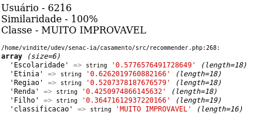
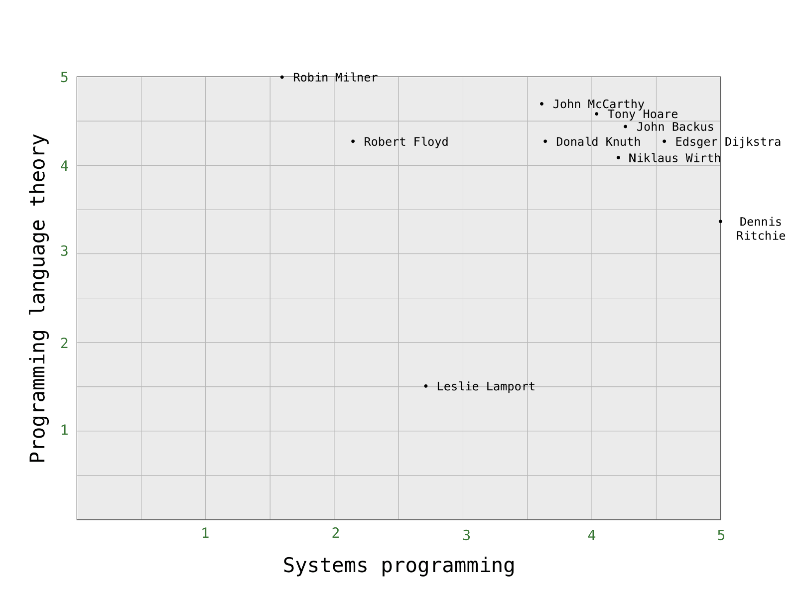

# casamento
# Contexto
> Construir um sistema para apoio na decisão entre a probabilidade de um casamento dar certo entre dois seres humanos.

# Objetivo
> Realizar cálculos com o auxílio da Inteligência Artificial baseado no cálculo de distância de Euclidiana para apresentar uma predição de qual a probabilidade da pessoa casar.

## Arquitetura do projeto

## Exemplo de resultado

## Distância euclidiana

